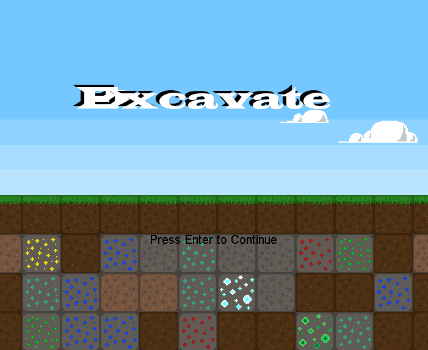

# Excavate

An exploration and resource collecting game about digging to the center of the Earth. Collect rare earth minerals and ores and exchange them for drill upgrades. How deep can you dig?

One of my first ever game projects. Made entirely in Java. Unfortunately the source code has been lost to time and all that remains is an executable jar file.

## Play Now

Download the application for free from: https://dispixel.itch.io/excavate

  
  
  

## Features

### Explore The Depths

Dig ever deeper into the Earth and collect a variety of rare and precious minerals and ores!

### Improve Your Drill

The deeper you go, the harder it gets! Exchange your rare resources on the surface to improve your drill and continue your journey into the depths!

© Nathan Foote | 2015

